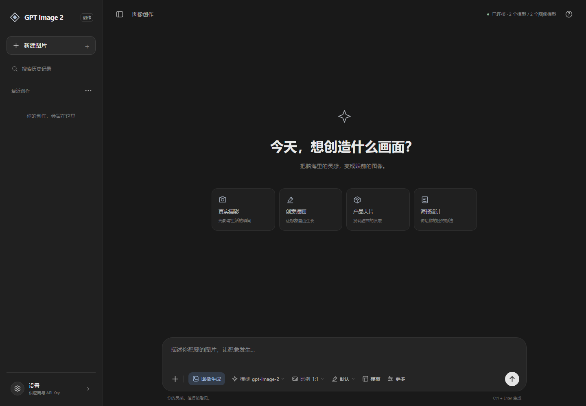

# GPT Image 2 Studio

一个跑在本机的生图工作台：填入**第三方中转站（OpenAI 兼容网关）**的地址与 API Key，
工具会自动拉取该站点的模型列表、筛出图像模型，然后调用 `gpt-image-2` 等模型文生图 / 图生图。

对话式界面，支持电脑、平板和手机布局。设置中可切换深色、浅色或跟随系统，选择会保存在当前设备。供应商地址和 API Key 位于设置窗口，输入框下方可选择模型、比例、风格与提示词模板。



- **零依赖**：只用 Node 内置模块，不需要 `npm install`（这台机器上 npm 被策略禁用也能跑）。
- **自动获取模型**：按「API Key + 供应商地址」请求 `GET /v1/models`，自动识别图像模型并优先排序。
- **单次提交**：每次生成只发送一次请求，失败后不自动换接口或格式重发。
- **实时显影**：若上游返回流式预览帧（`partial_image`），界面会边生成边显示低清预览，逐步变清晰。
- **本地留存**：图片存 `.gptimage2/gallery/`，参数与历史存 `.gptimage2/history.json`，重启不丢。
- **链接结果也保存**：1.2.4 起，电脑版收到上游图片链接后会下载原图到 `gallery`，成功后显示本地图片；下载或写入失败会保留原结果并提示，不会重发生图。
- **配置保存在本机**：密钥写入本机配置，仅随请求发送给你设置的供应商进行鉴权。

---

## 一、启动

要求：Node.js ≥ 18（推荐 20+）。本机已验证 v24。

```bash
# 方式一：双击
启动工具.bat

# 方式二：命令行
node server/cli.js               # 默认 http://127.0.0.1:8787 并自动打开浏览器
node server/cli.js --port 8899   # 换端口
node server/cli.js --no-open     # 不自动开浏览器
node server/cli.js --lan         # 允许局域网访问（注意：他人可打开你的配置页）
```

停止：在该窗口按 `Ctrl + C`。

### 安卓

安卓版本位于 `android/`，安装后可在手机或平板的设置里填写供应商地址与 API Key，独立连接图像服务，无需启动电脑端服务。支持 Android 8.0 及以上。

手机与电脑的密钥、历史和图片分别保存在各自设备上，不会自动同步。安卓构建方式见 [android/README.md](android/README.md)。

安卓生成的完整图片会自动保存到手机相册的 **GPT Image 2** 相册（`Pictures/GPT Image 2`），应用内同时保留图片和提示词历史。Android 10 及以上无需相册读取权限即可保存本应用生成的图片；Android 8/9 首次生成时会申请存储权限。相册保存失败会提示原因，不会重发生图请求，也不影响已收到的结果。此前的历史图片不会批量补存。

生成过程中可以打开设置查看配置和切换外观；连接参数、获取模型、连通性检测及保存设置会暂时锁定，当前任务结束后恢复。

## 二、三步用起来

1. 打开左下角 **设置**，填写 **供应商地址**，例如 `https://api.xxx.com`。
   带不带 `/v1` 都行，粘贴整条 `https://api.xxx.com/v1/images/generations` 也会被自动裁剪成根地址。
2. 填写 **API Key**，可点 **获取模型** 检查可用模型，然后点 **保存设置**。
   工具会请求 `/v1/models`，自动筛出图像类模型（`gpt-image*`、`dall-e*`、`flux`、`seedream`、`nano-banana`…）并按优先级排在最前，默认选中 `gpt-image-2`。
   拉不到列表时会回退到常见模型名，也可以直接在输入框手填模型 ID。
3. 在底部输入框下方选择 **模型、比例、风格**，写下提示词后点发送箭头（`Ctrl + Enter` 也能触发）。
   没有上传图片时自动文生图，上传后自动图生图（最多 10 张，顺序对应「图1/图2…」）；删除最后一张或清空图片后自动回到文生图，无需手动选择模式。模板可以填入可编辑的示例提示词。

手机点击 **＋ 相册** 可浏览最近图片，展开全屏，并按“所有照片”或相册分类多选。首次使用会请求系统照片访问权限；仅允许部分照片或拒绝权限时，也可以通过系统选择器选图。电脑点击 **＋ 图片** 打开文件选择器，也支持拖入或粘贴。

生成结果显示在中间对话区。左侧历史记录支持搜索、重新查看、删除；「新建图片」清空当前画面，保留已保存记录。点结果图片可放大、下载或复用参数。

风格选项通过在提示词末尾追加风格描述生效，最终发送的提示词会显示在对话区并保存在历史中。质量、张数、背景和输出格式位于「更多参数」，代理、超时和接口协议位于设置窗口。

## 三、这个工具替你处理了哪些中转站差异

| 场景 | 处理方式 |
| --- | --- |
| 地址带不带 `/v1`、带不带具体接口路径 | 归一化成一个根地址，再拼 `/v1/...` |
| `/v1/models` 不可用 | 回退内置常见图像模型名，允许手填 |
| `/v1/models` 返回结构不同（`data` / `models` / `result` / 纯数组） | 自动解析并去重 |
| 文生图接口 | `POST /v1/images/generations`，JSON，`b64_json` 或 URL 都能解析 |
| 改图接口只认 multipart | 默认 `POST /v1/images/edits` 走 multipart/form-data 上传 `image` 字段 |
| 改图接口只认 JSON | 在设置中选择 JSON + base64 的 `image` 字段 |
| 该站只有 chat 接口能出图 | 在设置中选择 `/v1/chat/completions`，可从 Markdown 图片链接里取出图片 |
| 该站是新版 Responses 风格 | 在设置中选择 `/v1/responses`，解析 `image_generation_call.result` |
| 返回流式 SSE | 解析 `partial_image` 帧实时预览，并等待最终成片 |
| 返回结构五花八门（`b64_json` / `image_base64` / `result` / `image_url` / `url` / dataURL / markdown） | 递归抽取，全部兼容 |
| 上游报错 | 原样透传状态码、`message` 与 `x-request-id`，错误卡片里列出每一步尝试记录 |
| 上游返回 HTML / 非 JSON | 给出可读错误提示，而不是静默失败 |
| 高阶画质排队久 | 默认超时 600 秒（高级设置可调到 3600），期间每 10 秒心跳，界面持续显示已用时长 |

## 四、参数说明

- **尺寸**：`auto` / `1024x1024` / `1536x1024` / `1024x1536` / `2048x2048` / `2048x1152` / `1152x2048`，也可自定义（gpt-image 系列校验严格，**宽高需为 16 的倍数**，如 `1280x720`）。
- **质量**：`auto` / `low` / `medium` / `high`。gpt-image 系列的质量档位直接影响耗时与消耗。
- **背景**：`transparent` 仅在 `png`/`webp` 输出格式下有意义，且部分中转站不支持。
- **输出格式**：`auto` 交给上游决定；显式选择时只对 `gpt-image*` 模型下发，避免其它模型报参数错误。
- **调用方式 / 改图接口格式**：默认 `auto` 使用 Images 接口，改图使用 multipart；每次只提交一次，可按供应商要求手动选择其他格式。
- **自定义比例**：在比例菜单输入 `1280*720` 或 `1280x720` 后点「应用」，星号会转成 `x`。
- **审核强度**：`low` 对应上游的 `moderation: low`，不是所有站都实现。

## 五、本地接口（想脚本化调用时用）

服务同时是一层本地 API，可直接 curl（无需带密钥参数时用已保存配置）：

```bash
# 健康检查
curl http://127.0.0.1:8787/api/health

# 自动获取模型（探针式，不落盘）
curl -X POST http://127.0.0.1:8787/api/models \
  -H "Content-Type: application/json" \
  -d '{"baseUrl":"https://api.xxx.com","apiKey":"sk-xxx"}'

# 连通性检测
curl -X POST http://127.0.0.1:8787/api/test \
  -H "Content-Type: application/json" \
  -d '{"baseUrl":"https://api.xxx.com","apiKey":"sk-xxx"}'

# 生图（stream:false 直接拿 JSON）
curl -X POST http://127.0.0.1:8787/api/generate \
  -H "Content-Type: application/json" \
  -d '{"model":"gpt-image-2","prompt":"暗房里的橘猫","size":"1024x1024","stream":false}'

# 图生图：images 传 dataURL 数组
curl -X POST http://127.0.0.1:8787/api/generate \
  -H "Content-Type: application/json" \
  -d '{"model":"gpt-image-2","prompt":"把背景换成雨夜霓虹街道","images":["data:image/png;base64,...."],"stream":false}'
```

返回的图片路径是 `/gallery/<文件名>`，也就是 `.gptimage2/gallery/` 下的真实文件。

## 六、目录结构

```
server/store.js     本地配置与历史持久化（.gptimage2/）
server/relay.js     中转站适配层：URL 归一化、模型列表、多协议请求、结果抽取
server/net.js       网络出口：HTTP(S) 代理支持、系统代理自动探测、连接诊断
server/server.js    HTTP 服务与业务逻辑（/api/* 与静态资源）
server/cli.js       启动入口（端口、自动开浏览器）
web/index.html      界面结构
web/styles.css      暗房风格样式
web/app.js          前端逻辑（原生 ES Module，无构建步骤）
test/smoke.js       端到端冒烟测试（内置模拟中转站，不需要真实密钥）
```

## 七、测试

```bash
node test/smoke.js
```

会起一个模拟中转站（含 `/v1/models`、两种图像接口、chat、responses、401、返回 HTML、405 降级等分支），
再起工具服务端，跑完 30+ 项断言：模型自动获取与筛选排序、文生图、图生图 multipart、上游返回 URL、
历史持久化、401 错误透传、改图接口 405 降级、非 JSON 容错、内网拦截、静态资源等。
测试数据写在系统临时目录，不会污染你的真实配置。

```bash
node test/run-all.js           # 一键跑全部（不需要 API Key，不接触任何真实中转站）
```

| 套件 | 覆盖内容 |
| --- | --- |
| `ui-static-check.js` | 前端 DOM id / class / 路由引用一致性 |
| `gateway-errors.js` | 代理隧道空响应、CONNECT 被拒 502、无 body 的流式响应 —— 保证错误归因准确 |
| `proxy-shapes.js` | 明文 HTTP 走代理时的 SSE 流式与 chunked 解码（以前会崩在 `body.getReader`） |
| `net-e2e.js` | 直连 / 经代理 / **本机地址永不走代理** / SSE 逐帧 / 超时归因 |
| `smoke.js` | 全链路：模型获取、文生图、图生图、降级链、历史持久化、静态资源 |

单独跑：`node test/smoke.js`。测试数据写在系统临时目录，不会污染你的配置。

### 没有真实中转站也能先玩

内置一个模拟中转站（OpenAI 兼容，支持流式预览帧），可以在拿到真实密钥前把整条链路和界面跑通：

```bash
# 终端 1：模拟中转站（返回彩色测试图，支持 SSE 预览帧）
node test/mock-relay.js --port 8899 --token sk-mock-token

# 终端 2：本工具
node server/cli.js
```

界面上填地址 `http://127.0.0.1:8899`、密钥 `sk-mock-token`，并**勾选「允许内网 / localhost 地址」**，即可获取模型并出图。

### 界面截图（开发自检用）

```bash
# 无头 Edge/Chrome + CDP，无第三方依赖
node test/browser-shot.js --url http://127.0.0.1:8787 --out shot.png --no-help
node test/browser-shot.js --url http://127.0.0.1:8787 --out shot.png --setup my-setup.js --no-help
```

`--setup` 接受一个 JS 文件，在截图前于页面里执行（可用于自动填表、点按钮、读回页面状态），
配合 `--gen-wait` 就能在一次运行里截到"生成完成"的完整界面。

## 八、常见问题

| 现象 | 原因 / 处理 |
| --- | --- |
| `401` / `403` | 密钥无效，或该令牌所在分组没有图像模型权限。工具遇到 401 会立即停止重试。 |
| `404` / model not found | 模型名要填列表里的准确 ID，部分站点是 `gpt-image-2-vip`、`gpt-image-2-all` 之类。 |
| `400` 参数错误 | 先用 `1024x1024` + `quality: auto` 跑通，再逐项加参数。尺寸要符合该模型的允许集合。 |
| 一直转圈 | 中转站排队中。日志区会显示每一步尝试；高阶画质 1–4 分钟属正常。 |
| `fetch failed`，浏览器能开但工具不行 | 典型是**代理**问题：浏览器走系统代理，Node 默认直连。工具已内置代理支持（默认 `auto` 自动读系统代理），也可在「网络代理」里手填 `http://127.0.0.1:7890` 这类地址，点「探测」查看当前出口。 |
| 报"域名解析失败" | 该域名在公共 DNS 里不存在（很多代理用 fake-ip，浏览器能开不代表 Node 能解析）。先确认供应商给的地址是否还有效。 |
| 报"连接被重置 / 502" | 网关在但后端服务挂了，或代理节点不可达 —— 换域名或联系供应商。 |
| 自建中转在本机 | 本机与内网地址**永远不走代理**，无需额外配置。 |
| 拿不到模型列表 | 有些站不开放 `/v1/models`，直接手填模型名即可，其它功能不受影响。 |
| 想连本机/内网的自建中转 | 勾选「允许内网 / localhost 地址」——默认关闭是防止密钥被误发到内网地址。 |
| 端口被占用 | `node server/cli.js --port 8899` |

## 九、安全边界

- 服务默认只监听 `127.0.0.1`；`--lan` 才会对外，届时同网段的人能打开你的配置页，慎用。
- 密钥保存在 `.gptimage2/config.json`，接口返回给前端时一律打码（只回传前后各几位）。
- 默认禁止把请求发往内网 / localhost 地址（SSRF 防护），自建中转需显式开启。
- 生成历史与图片都在本机 `.gptimage2/` 目录，删掉该目录即彻底清除。
